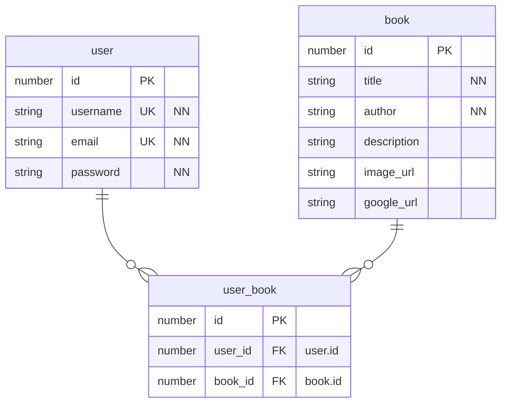
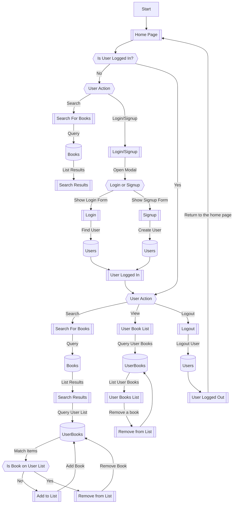

# Bookle: MERN Book Search Engine

Homework Challenge 21, Due March 21, 2023

> TODO: Screenshot and a link to the deployed app goes here.

## Preparation

This week, you’ll take a fully functioning Google Books API search engine built with a RESTful API, and refactor it to be a GraphQL API built with Apollo Server. The app was built using the MERN stack, with a React front end, MongoDB database, and Node.js/Express.js server and API. It's already set up to allow users to save book searches to the back end.

To fulfill the Challenge, you’ll need to do the following:

1. Set up an Apollo Server to use GraphQL queries and mutations to fetch and modify data, replacing the existing RESTful API.
2. Modify the existing authentication middleware so that it works in the context of a GraphQL API.
3. Create an Apollo Provider so that requests can communicate with an Apollo Server.
4. Deploy the application to Heroku.

> Note: The initial name of this app was "googlebooks-app". I changed it to "bookle". I will need to make sure this name is applied everywhere.

## User Story

```text
AS AN avid reader
I WANT to search for new books to read
SO THAT I can keep a list of books to purchase
```

## Acceptance Criteria

```text
GIVEN a book search engine
WHEN I load the search engine
THEN I am presented with a menu with the options Search for Books and Login/Signup and an input field to search for books and a submit button
WHEN I click on the Search for Books menu option
THEN I am presented with an input field to search for books and a submit button
WHEN I am not logged in and enter a search term in the input field and click the submit button
THEN I am presented with several search results, each featuring a book’s title, author, description, image, and a link to that book on the Google Books site
WHEN I click on the Login/Signup menu option
THEN a modal appears on the screen with a toggle between the option to log in or sign up
WHEN the toggle is set to Signup
THEN I am presented with three inputs for a username, an email address, and a password, and a signup button
WHEN the toggle is set to Login
THEN I am presented with two inputs for an email address and a password and login button
WHEN I enter a valid email address and create a password and click on the signup button
THEN my user account is created and I am logged in to the site
WHEN I enter my account’s email address and password and click on the login button
THEN I the modal closes and I am logged in to the site
WHEN I am logged in to the site
THEN the menu options change to Search for Books, an option to see my saved books, and Logout
WHEN I am logged in and enter a search term in the input field and click the submit button
THEN I am presented with several search results, each featuring a book’s title, author, description, image, and a link to that book on the Google Books site and a button to save a book to my account
WHEN I click on the Save button on a book
THEN that book’s information is saved to my account
WHEN I click on the option to see my saved books
THEN I am presented with all of the books I have saved to my account, each featuring the book’s title, author, description, image, and a link to that book on the Google Books site and a button to remove a book from my account
WHEN I click on the Remove button on a book
THEN that book is deleted from my saved books list
WHEN I click on the Logout button
THEN I am logged out of the site and presented with a menu with the options Search for Books and Login/Signup and an input field to search for books and a submit button
```

## TODO List

- [ ] Set up an Apollo Server to use GraphQL queries and mutations to fetch and modify data, replacing the existing RESTful API.
  - [ ] Set up MongoDB database/collection
  - [ ] Set up GraphQL
  - [ ] Set up Apollo Server
- [ ] Modify the existing authentication middleware so that it works in the context of a GraphQL API.
- [ ] Create an Apollo Provider so that requests can communicate with an Apollo Server.
- [ ] Deploy the application to Heroku.
- [ ] Website requirements
  - [ ] Menu with options to Search for books
    - Login/Signup links
    - Input field to search for books with a submit button
  - [ ] Click on Search for Books menu option displays input field to search for books with a submit button
  - [ ] Click on Login/Signup shows a modal with a toggle between the option to log in or sign up
  - [ ] Pressing Enter in the search field or clicking on the search submit button displays search results. Each search result should include
    - Book title
    - Book author(s)
    - Book description
    - Book image
    - Link to that book on the Google Books site
  - [ ] When clicking on Signup on the Login/Signup modal, Display the Signup form with the following
    - Username
    - Email Address
    - Password
    - Signup Button
  - [ ] When clicking the Login on the Login/Signup modal, Display the Login form with the following
    - Username
    - Password
    - Login Button
  - [ ] When logged in, the menu options change to
    - Search For books
    - Option to see saved books ("my saved books list")
    - Logout
  - [ ] When logged in, Pressing Enter in the search field or clicking on the search submit button displayed search results which will include
    - Book title
    - Book author(s)
    - Book description
    - Book image
    - Link to that book on the Google Books site
    - A button to save/remove a book from my saved books list
  - [ ] When logged in and I click on the "my saved books list", list all the books that I have saved with
    - Book title
    - Book author(s)
    - Book description
    - Book image
    - Link to that book on the Google Books site
    - A button to remove a book from my saved books list
  - [ ] When I click on a "remove book" button from my saved books list, the book is removed from my list.
  - [ ] When I click logout, I am logged out of the site and presented with the initial homepage

## Database Structure

> Note: NN = "Not Null", that is "Required". UK = "Unique (Key)", that is there should not be two of the same value in the database.



## Flow Chart



There'd be more thorough actions in this flow chart, but we need to keep it short this time around.
