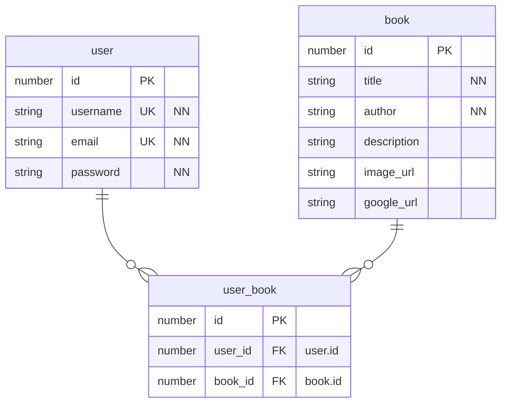

# Database Structure

> Note: NN = "Not Null", that is "Required". UK = "Unique (Key)", that is there should not be two of the same value in the database.

```mermaid
erDiagram
    user {
        number id PK
        string username UK "NN"
        string email UK "NN"
        string password "NN"
    }

    book {
        number id PK
        string title "NN"
        string author "NN"
        string description
        string image_url
        string google_url
    }

    user_book {
        number id PK
        number user_id FK "user.id"
        number book_id FK "book.id"
    }

    user ||--o{ user_book : ""
    book ||--o{ user_book : ""
```