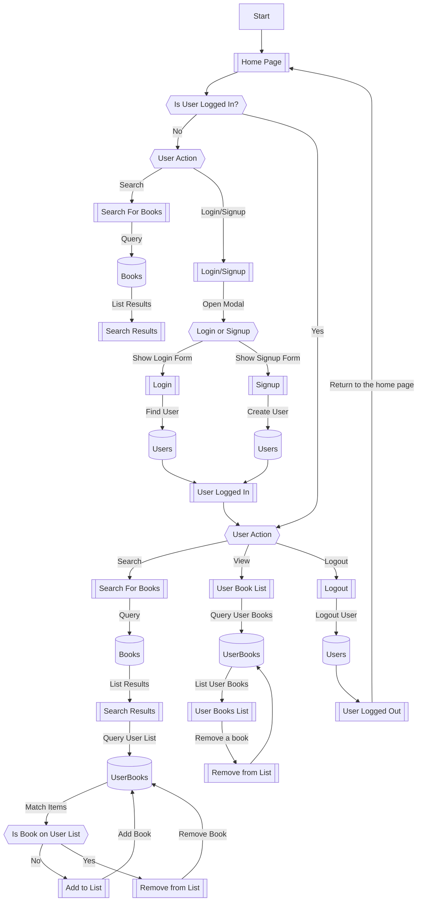

# Flow Chart

```mermaid
flowchart TD
    Start
    sub0[[Home Page]]
    action0{{Is User Logged In?}}
    Start --> sub0
    sub0 --> action0

    action1a{{User Action}}
    action1b{{User Action}}
    action0 -- No --> action1a
    action0 -- Yes ---> action1b
    
    sub1a[[Search For Books]]
    db1[(Books)]
    sub1a -- Query --> db1
    sub1c[[Search Results]]
    db1 -- List Results --> sub1c

    sub2[[Login/Signup]]
    action2{{Login or Signup}}
    action1a -- Search --> sub1a
    action1a -- Login/Signup ---> sub2
    sub2 -- Open Modal --> action2
    sub3[[Login]]
    sub4[[Signup]]
    action2 -- Show Login Form --> sub3
    action2 -- Show Signup Form --> sub4
    db3[(Users)]
    db4[(Users)]
    sub3 -- Find User --> db3
    sub4 -- Create User --> db4
    
    sub1b[[Search For Books]]
    action1b -- Search --> sub1b
    sub5[[User Book List]]
    action1b -- View --> sub5
    sub6[[Logout]]
    action1b -- Logout --> sub6

    sub7[[User Logged In]]
    db3 --> sub7
    db4 --> sub7
    sub7 --> action1b

    db5[(Books)]
    sub1b -- Query --> db5
    sub1d[[Search Results]]
    db5 -- List Results --> sub1d
    action4{{Is Book on User List}}
    db8[(UserBooks)]
    sub1d -- Query User List --> db8
    db8 -- Match Items --> action4
    sub1e[[Add to List]]
    sub1f[[Remove from List]]
    action4 -- No --> sub1e
    sub1e -- Add Book --> db8
    action4 -- Yes --> sub1f
    sub1f -- Remove Book --> db8

    db6[(UserBooks)]
    sub5 -- Query User Books --> db6
    sub9[[User Books List]]
    db6 -- List User Books --> sub9
    sub10[[Remove from List]]
    sub9 -- Remove a book --> sub10
    sub10 --> db6

    db7[(Users)]
    sub6 -- Logout User--> db7
    sub8[[User Logged Out]]
    db7 --> sub8
    sub8 -- Return to the home page --> sub0
```

There'd be more thorough actions in this flow chart, but we need to keep it short this time around.
